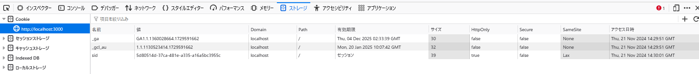

このサーバでは Cookie を使ってクライアントのセッションを識別し、タスク一覧をセッションごとに分離して管理する簡易的な認証/認可を行っている。サーバが設定している Cookie の値は sid=<セッションに一意に割り当てた ID>; SameSite=Lax; Path=/; HttpOnly; である。ToDo アプリでいくつかのタスクを作成した後、以下に挙げる操作を実施したとき、それぞれどのような結果になるか記載し、その理由を説明しなさい。

### index.js でdocument.cookie プロパティを console.logで表示する
  `_gcl_au=1.1.1130523414.1729591662; _ga=GA1.1.1360028664.1729591662` が出力される

### ブラウザの開発者コンソールで http://localhost:3000/ の Cookie を表示する
  

### ToDo アプリのタブをリロードする
  変化しない

### 同一ブラウザの異なるタブやウィンドウで http://localhost:3000/ を開いて ToDo リストの状態を確認する
  同一ブラウザの ToDo リストと同じ状態で表示される

### シークレットウィンドウや異なるブラウザで http://localhost:3000/ を開いて ToDo リストの状態を確認する
  リストが追加されていない初期状態で表示される

### http://127.0.0.1:3000/ を開いて ToDo リストの状態を確認する
  リストが追加されていない初期状態で表示される
