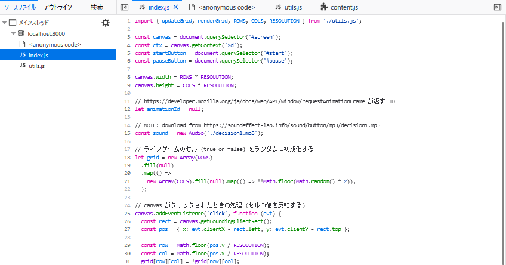
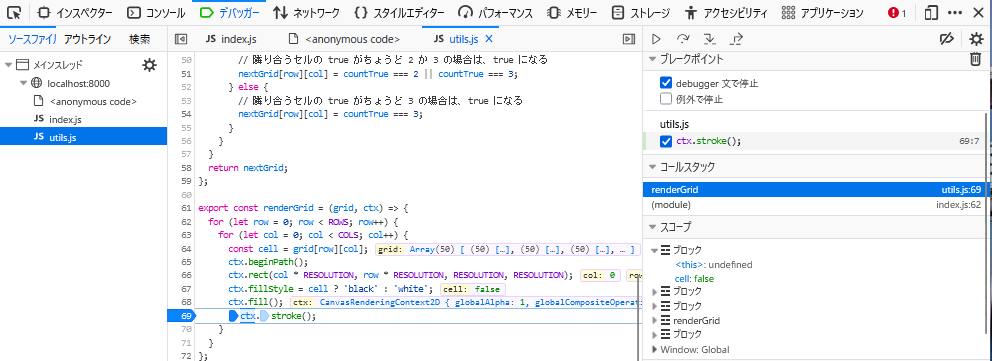

> 開発者ツールで ソース タブ(Chrome, Edge, Safari) または デバッガー タブ(Firefox) を開き、ソースコードファイルがどのように表示されるかを確認しなさい。

バンドル後のコードだけでなく、元のソースコード (index.js や utils.js) が表示される。

> バンドルしたコードの実行中に、バンドル前のソースコードファイルに基づいたブレークポイントの設定や変数の値の確認等のデバッグが可能か確認しなさい。

- ブレークポイントの設定：可能
- 変数の値の確認：可能

