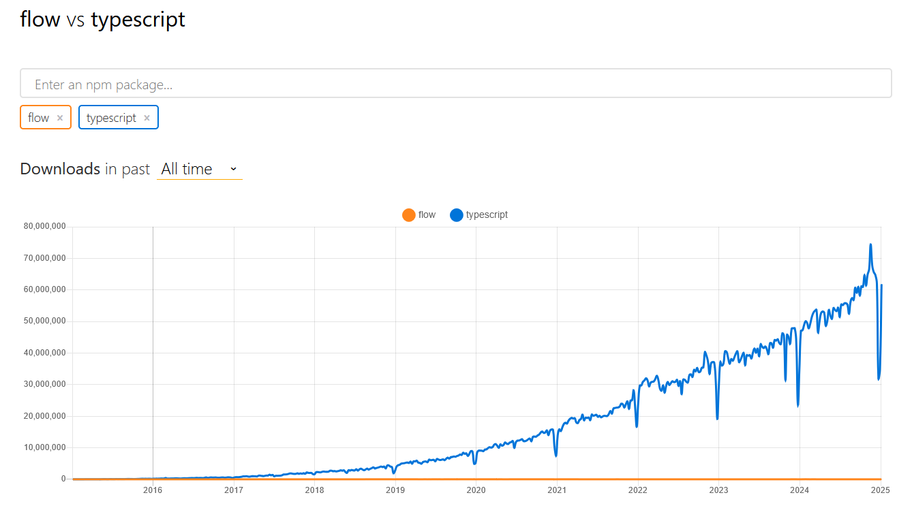

> TypeScriptとFlowについて、どちらが主流となっているかを調べなさい。
> また、その理由を考えてまとめなさい。

TypeScript が主流

理由
- TypeScript は列挙型やインターフェースなどの高度な機能を提供し、大規模プロジェクトに最適。Flow は型チェックに特化しているが、利便性の高い機能が不足している。
- TypeScript は大規模で活発なコミュニティがあり、学習やサポートが充実しているが、Flow は小規模でリソースが限られている。
- Microsoft のサポートにより、TypeScript は継続的な進化と長期的な利用が期待できるが、Flow の将来性は不透明。
- TypeScript は厳格な型チェックでエラーを早期に発見可能。Flow はオプトイン方式で検出力に劣る。

[Flow vs TypeScript: Which Is Better Suited For Your Next Project?](https://www.scalablepath.com/javascript/flow-vs-typescript?utm_source=chatgpt.com)
